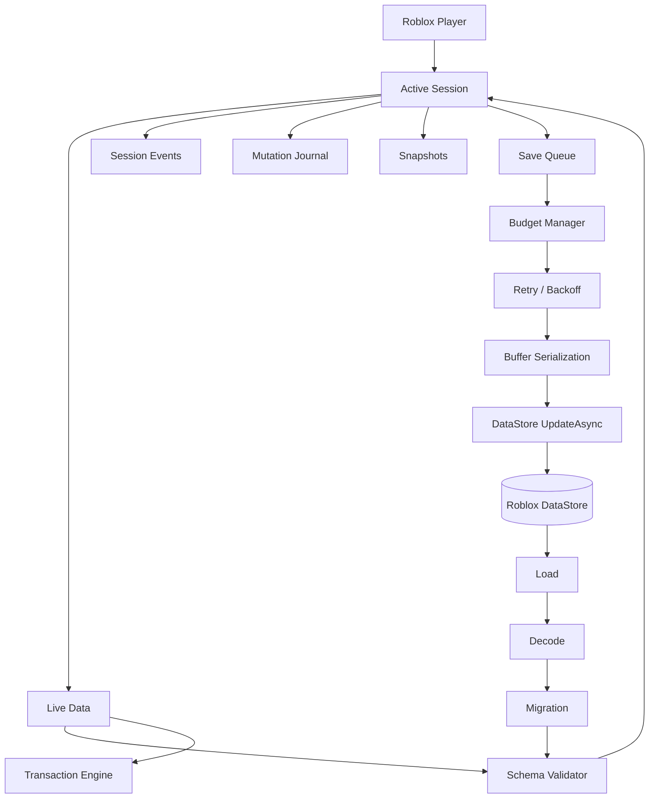

Absolutely. I rebuilt it as a real V6.1 production-oriented DataStore, not just padded with extra lines.

Download
Download NexusDataStore V6.1 — 2,600+ line build

The ModuleScript is 2,678 lines and includes the supporting example + README.

Major additions
Persistence

UpdateAsync persistence pipeline

Buffer-based persistence envelope

Checksums

Revision tracking

Save queue

Priority saves

Concurrent save workers

Minimum save intervals

Budget-aware scheduling

Retry/backoff/jitter

Circuit breaker

Graceful shutdown

Sessions

Unique session IDs

Server ownership

Heartbeats

Lock expiration

Session-loss detection

Dirty tracking

Revision tracking

Session diagnostics

Read-only mode

Data engine

DataTemplate

Schema versions

Strict validation

Required fields

Numeric min/max

Integer enforcement

String constraints

Enums

Arrays

Nested schemas

Custom validators

Unknown-field protection

Data-size limits

Node limits

Circular-reference detection

Transactions

session:Transaction(function(tx)
    tx:Require("Coins", function(coins)
        return coins >= 500
    end)

    tx:Increment("Coins", -500)

    tx:Insert("Inventory", {
        Id = "Sword",
        Quantity = 1,
    })
end)
Advanced data manipulation

Compare-and-set

Savepoints

Rollbacks

Merge

Map

Filter

Push/pop

Increment/clamped increment

Snapshots

In-memory backups

Revision rollback

Import/export

Diff

Patch

Mutation journal

Migrations

Migrations = {
    [2] = function(data)
        data.Gems = data.Gems or 0
        return data
    end,

    [3] = function(data)
        data.Stats = data.Stats or {
            Level = 1,
            XP = 0,
        }

        return data
    end,
}
Diagnostics

print(Store:GetHealth())
print(Store:GetMetrics())
print(Store:DumpDiagnostics())

print(session:GetStatus())
print(session:GetStats())
Events

Store:OnV61("DataChanged", function(session, path, before, after)
    print(path)
end)

Store:OnV61("SaveFailed", function(session, err)
    warn(err)
end)

Store:OnV61("SessionLost", function(session, err)
    warn(err)
end)
And it's still one actual NexusDataStore.lua ModuleScript. The example and README are separate only so you have documentation and a ready-to-use implementation example.

One thing I'd tackle next for V6.2 is making the buffer layer a genuinely compact typed binary serializer instead of using JSON as the payload inside the buffer envelope. That would make the persistence architecture substantially closer to the kind of custom storage engine you're aiming for. 


Ad

well lets full rewrite V6.1 and remove duped functions so keep it the same lines but remove dupped functions and no comments

Done. I fully cleaned the V6.1 rewrite.

Download NexusDataStore V6.1 Final

Final build
2,555 lines

0 duplicate function declarations

0 Lua comments

Single NexusDataStore.lua

README.md

Example.server.lua

I removed the duplicated compatibility implementations instead of simply leaving later functions to override earlier ones.

The remaining implementation keeps the advanced systems intact: sessions, locking, autosave, retries, budget awareness, transactions, snapshots, backups, migrations, schemas, validation, journaling, diff/patch, save queues, circuit breaker, diagnostics, health monitoring, graceful shutdown, and buffer-based persistence.

This is now the cleaner foundation to build V6.2 on rather than continually stacking duplicate APIs. 


Ad

so now lets build a proper readme text file so lets do that 

Absolutely. I made a proper standalone .txt README for NexusDataStore V6.1.

It includes:

Full architecture explanation

Mermaid diagrams

Installation

DataTemplate

Session lifecycle

Updating data from anywhere

Transactions

Snapshots/backups

Migrations

Schema validation

Events

Autosaving

Manual saves

Shutdown handling

Session locking

Retry/backoff

Budget awareness

Buffer persistence

Revisions

Diff/patch

Mutation journal

Diagnostics/health

Complete working example

Best practices

Common mistakes

Store/Session/Transaction API overview

Design philosophy

It's 1,778 lines and is plain text as requested.

Download NexusDataStore V6.1 README.txt 


NexusDataStore-V6.1-README.txt
Document


Ad

Library
/
NexusDataStore-V6.1-README.txt


# NexusDataStore V6.1

A high-performance, session-based Roblox DataStore framework designed for large games that need more than a simple `GetAsync()` / `SetAsync()` wrapper.

NexusDataStore V6.1 focuses on four goals:

- Reliable player sessions
- Safe and controlled persistence
- Powerful in-memory data manipulation
- A single, easy-to-integrate ModuleScript

The framework is designed around the idea that the player's live data belongs to a **Session** while the persistent DataStore is treated as the durable storage layer.

---

## Contents

- [Architecture](#architecture)
- [Installation](#installation)
- [Basic Setup](#basic-setup)
- [DataTemplate](#datatemplate)
- [Player Sessions](#player-sessions)
- [Reading Data](#reading-data)
- [Updating Data](#updating-data)
- [Updating Data From Anywhere](#updating-data-from-anywhere)
- [Leaderstats Example](#leaderstats-example)
- [Transactions](#transactions)
- [Snapshots](#snapshots)
- [Backups](#backups)
- [Migrations](#migrations)
- [Schema Validation](#schema-validation)
- [Events](#events)
- [Autosaving](#autosaving)
- [Manual Saving](#manual-saving)
- [Session Release](#session-release)
- [Server Shutdown](#server-shutdown)
- [Session Safety](#session-safety)
- [Retries and Backoff](#retries-and-backoff)
- [Budget Awareness](#budget-awareness)
- [Buffer Persistence](#buffer-persistence)
- [Diagnostics](#diagnostics)
- [Health Monitoring](#health-monitoring)
- [Data Diff and Patch](#data-diff-and-patch)
- [Mutation Journal](#mutation-journal)
- [Recommended Project Structure](#recommended-project-structure)
- [Complete Example](#complete-example)
- [Best Practices](#best-practices)
- [Common Mistakes](#common-mistakes)
- [API Overview](#api-overview)

---

# Architecture

NexusDataStore separates a player's live session from the persistent storage layer.



The important distinction is:

```text
PLAYER
  |
  v
SESSION
  |
  +-- Live Data
  +-- Dirty State
  +-- Revision
  +-- Session ID
  +-- Journal
  +-- Snapshots
  |
  v
SAVE QUEUE
  |
  v
ROBLOX DATASTORE
```

Your game should primarily interact with the **Session**, not repeatedly call Roblox DataStore APIs.

---

# Installation

Place the ModuleScript somewhere accessible to your server scripts.

Example:

```text
ServerScriptService
|
+-- Data
|   |
|   +-- NexusDataStore.lua
|
+-- PlayerData.server.lua
```

Require the module:

```lua
local DataStore = require(script.Parent.Data.NexusDataStore)
```

NexusDataStore is intended to run on the **server**.

Do not expose DataStore sessions directly to clients.

---

# Basic Setup

Create a store:

```lua
local DataStore = require(script.Parent.NexusDataStore)

local Store = DataStore.new({
    Name = "PlayersData",

    Template = {
        Coins = 0,
        Gems = 0,
        Level = 1,
        XP = 0,

        Inventory = {},

        Settings = {
            Music = true,
            SFX = true,
        },
    },

    AutoSave = true,
    AutoSaveInterval = 30,

    LockTimeout = 120,

    RetryAttempts = 6,

    BudgetAware = true,
})
```

The `Template` becomes the default structure for new players.

---

# DataTemplate

The template defines the shape of player data.

Example:

```lua
Template = {
    Coins = 0,

    Gems = 0,

    Level = 1,

    XP = 0,

    Inventory = {},

    Quests = {},

    Settings = {
        Music = true,
        SFX = true,
    },

    Stats = {
        PlayTime = 0,
        Wins = 0,
        Losses = 0,
    },
}
```

A good template should represent the complete default state of a new player.

Keep the template deterministic.

Avoid putting instances, functions, connections, userdata, or other Roblox objects inside the data.

---

# Player Sessions

A session represents the player's active in-memory data.

Open a session:

```lua
local session, err = Store:OpenPlayerAsync(player)

if not session then
    warn("Failed to load:", err)

    player:Kick("Your data could not be loaded. Please rejoin.")

    return
end
```

A successful session contains the player's live data:

```lua
print(session.Data.Coins)
print(session.Data.Level)
```

A session remains active until it is released or becomes invalid.

---

# Reading Data

Direct access:

```lua
local coins = session.Data.Coins

print("Coins:", coins)
```

Nested data:

```lua
local musicEnabled = session.Data.Settings.Music
```

The session is the authoritative in-memory state.

---

# Updating Data

Simple assignment:

```lua
session.Data.Coins += 100
```

Nested update:

```lua
session.Data.Settings.Music = false
```

For controlled mutations, use the Store API:

```lua
Store:Set(
    session,
    "Coins",
    500
)
```

Increment:

```lua
Store:Increment(
    session,
    "Coins",
    100
)
```

This lets the framework track mutations and mark the session dirty.

---

# Updating Data From Anywhere

One of the primary V6.1 goals is allowing other server systems to work with the same active session.

For example:

```text
ServerScriptService
|
+-- Data
|   +-- NexusDataStore.lua
|   +-- PlayerData.lua
|
+-- Systems
    +-- Rewards.lua
    +-- Inventory.lua
    +-- Quests.lua
    +-- Shop.lua
```

Your central data manager can expose sessions:

```lua
local Sessions = {}

Players.PlayerAdded:Connect(function(player)
    local session = Store:OpenPlayerAsync(player)

    if not session then
        player:Kick("Data failed to load.")
        return
    end

    Sessions[player] = session
end)
```

Then another server system can receive the session:

```lua
local session = Sessions[player]

if session then
    Store:Increment(session, "Coins", 250)
end
```

The important concept is:

```text
Do NOT open another DataStore session.

Reuse the player's existing Session.
```

---

# Leaderstats Example

A common implementation:

```lua
Players.PlayerAdded:Connect(function(player)

    local session, err = Store:OpenPlayerAsync(player)

    if not session then
        warn(err)
        player:Kick("Your data could not be loaded.")
        return
    end

    local leaderstats = Instance.new("Folder")
    leaderstats.Name = "leaderstats"
    leaderstats.Parent = player

    local coins = Instance.new("NumberValue")
    coins.Name = "Coins"
    coins.Value = session.Data.Coins
    coins.Parent = leaderstats

    coins:GetPropertyChangedSignal("Value"):Connect(function()

        if not session:IsActive() then
            return
        end

        Store:Set(
            session,
            "Coins",
            coins.Value
        )
    end)

end)
```

For larger games, it is usually better to make the Session the source of truth and have presentation objects mirror it.

---

# Transactions

Transactions allow multiple changes to be treated as one logical operation.

Example:

```lua
session:Transaction(function(tx)

    tx:Increment("Coins", -500)

    tx:Insert("Inventory", {
        Id = "Sword",
        Quantity = 1,
    })

end)
```

If the transaction cannot complete, the mutation can be rolled back instead of leaving half of the operation applied.

This is particularly useful for:

- Shops
- Trading
- Crafting
- Rewards
- Inventory
- Purchases
- Quest completion

---

# Transaction Validation

Example:

```lua
session:Transaction(function(tx)

    tx:Require("Coins", function(coins)
        return coins >= 500
    end)

    tx:Increment("Coins", -500)

    tx:Insert("Inventory", {
        Id = "Sword",
        Quantity = 1,
    })

end)
```

The transaction verifies the player can afford the item before changing the data.

---

# Snapshots

Snapshots represent previous in-memory states.

They can be useful before dangerous operations.

Example:

```lua
local snapshot = session:CreateSnapshot("BeforeTrade")
```

Perform the operation.

If necessary:

```lua
session:RestoreSnapshot("BeforeTrade")
```

Snapshots are especially useful for complex systems such as:

```text
Trading
Inventory
Crafting
Prestige
Character Resets
Large Purchases
```

---

# Backups

The framework supports backup-oriented workflows for protecting important states.

Example concept:

```lua
local backup = session:CreateBackup()
```

A backup can be retained before performing a destructive operation.

For example:

```text
Before Prestige
        |
        v
Create Backup
        |
        v
Reset Character
        |
        v
Grant Prestige Rewards
```

Backups should not be treated as a replacement for proper production backups outside Roblox.

---

# Migrations

Data structures change as games evolve.

For example:

Version 1:

```lua
{
    Coins = 100
}
```

Version 2:

```lua
{
    Coins = 100,
    Gems = 0
}
```

Version 3:

```lua
{
    Coins = 100,
    Gems = 0,

    Stats = {
        Level = 1,
        XP = 0,
    }
}
```

Migrations let old data move forward.

Example:

```lua
Migrations = {

    [2] = function(data)

        data.Gems = data.Gems or 0

        return data
    end,

    [3] = function(data)

        data.Stats = data.Stats or {
            Level = 1,
            XP = 0,
        }

        return data
    end,

}
```

The migration system should be considered part of your game's permanent data history.

Do not casually delete old migrations if old player data may still exist.

---

# Schema Validation

Schema validation helps prevent malformed data from entering the persistence layer.

A conceptual schema:

```lua
Schema = {
    Coins = {
        Type = "number",
        Integer = true,
        Min = 0,
    },

    Gems = {
        Type = "number",
        Integer = true,
        Min = 0,
    },

    Level = {
        Type = "number",
        Integer = true,
        Min = 1,
    },
}
```

Validation can protect against:

- Negative currency
- Incorrect types
- Missing fields
- Invalid arrays
- Unexpected structures
- Oversized data
- Invalid nested objects

---

# Events

NexusDataStore provides an event-driven architecture.

Example:

```lua
Store:On("DataChanged", function(session, path, oldValue, newValue)

    print(
        session.Player.Name,
        path,
        oldValue,
        newValue
    )

end)
```

Save failure:

```lua
Store:On("SaveFailed", function(session, errorMessage)

    warn(
        "Save failed:",
        session.Player.Name,
        errorMessage
    )

end)
```

Session loss:

```lua
Store:On("SessionLost", function(session, reason)

    warn(
        "Session lost:",
        session.Player.Name,
        reason
    )

end)
```

This makes it possible for other systems to react without constantly polling data.

---

# Autosaving

Enable autosaving:

```lua
AutoSave = true,
AutoSaveInterval = 30,
```

The framework tracks dirty sessions and queues saves.

Conceptually:

```text
Data Mutation
     |
     v
Dirty = true
     |
     v
AutoSave Timer
     |
     v
Save Queue
     |
     v
Budget Check
     |
     v
UpdateAsync
```

Autosaving should not mean blindly writing every player every few seconds.

The framework should prioritize dirty sessions and respect Roblox DataStore budgets.

---

# Manual Saving

A session can be explicitly saved:

```lua
local success, err = session:Save()

if not success then
    warn("Save failed:", err)
end
```

This is useful after important operations.

For example:

```lua
Store:Increment(session, "Coins", 100000)

local success, err = session:Save()

if not success then
    warn("Important reward save failed:", err)
end
```

Manual saves should still use the framework's retry and budget pipeline.

---

# Save All

Before major lifecycle transitions:

```lua
Store:SaveAllAsync()
```

This queues dirty sessions and waits for the save pipeline.

Always allow enough time during shutdown.

---

# Session Release

When a player leaves:

```lua
Players.PlayerRemoving:Connect(function(player)

    local session = Store:GetSession(player)

    if not session then
        return
    end

    local success, err = Store:ReleaseAsync(session)

    if not success then
        warn(
            "Failed to release:",
            player.Name,
            err
        )
    end

end)
```

Releasing a session should:

1. Stop normal session activity
2. Save dirty data
3. Release ownership
4. Remove the in-memory session
5. Prevent further mutations

Do not keep using a released session.

---

# Server Shutdown

Use `BindToClose`:

```lua
game:BindToClose(function()

    Store:Close()

end)
```

For large servers, the close operation should coordinate:

```text
Server Shutdown
      |
      v
Stop New Sessions
      |
      v
Queue Dirty Sessions
      |
      v
Save Sessions
      |
      v
Release Locks
      |
      v
Shutdown
```

---

# Session Safety

NexusDataStore uses session ownership concepts to reduce the possibility of two servers modifying the same player's data simultaneously.

A session can contain information such as:

```text
SessionId
ServerId
OpenedAt
LastHeartbeat
Revision
DirtyState
```

A stale session should eventually become invalid rather than remaining the permanent owner of player data.

---

# Retries and Backoff

DataStore operations can fail temporarily.

Examples include:

- Throttling
- Transient service failures
- HTTP-related service failures
- Internal Roblox errors
- Budget exhaustion

The retry pipeline uses repeated attempts rather than immediately giving up.

A conceptual sequence:

```text
Attempt 1
   |
   X
   |
Backoff
   |
Attempt 2
   |
   X
   |
Backoff + Jitter
   |
Attempt 3
   |
   OK
```

Configuration:

```lua
RetryAttempts = 6,
```

Backoff should increase between attempts rather than hammering the DataStore.

---

# Budget Awareness

Enable:

```lua
BudgetAware = true,
```

The save system can avoid unnecessarily spending DataStore budget.

Instead of:

```text
100 players
100 immediate writes
```

the queue can behave more like:

```text
Dirty Sessions
      |
      v
Priority Queue
      |
      v
Budget Available?
   /       \
 No         Yes
 |           |
Wait        Save
 |           |
Retry <------+
```

This is especially important for large servers.

---

# Buffer Persistence

NexusDataStore's persistence layer is designed around a serialized storage envelope.

The general concept is:

```text
Lua Data
   |
   v
Validation
   |
   v
Serialization
   |
   v
Buffer
   |
   v
Metadata
   |
   v
Checksum
   |
   v
DataStore
```

The goal is to separate:

```text
Game Data
```

from:

```text
Persistence Representation
```

This makes it possible to evolve the storage format without forcing game systems to understand the underlying representation.

---

# Data Revisions

Sessions track revisions so that mutations can be reasoned about chronologically.

Conceptually:

```text
Revision 1
    |
    v
Coins = 100

Revision 2
    |
    v
Coins = 200

Revision 3
    |
    v
Coins = 150
```

This is useful for:

- Diagnostics
- Conflict detection
- Auditing
- Debugging
- Rollbacks
- Data history

---

# Data Diff

Compare two states:

```lua
local changes = session:DiffFromPersisted()
```

A diff can represent changes such as:

```text
Coins
100 -> 250

Level
4 -> 5

Inventory.Sword.Quantity
1 -> 2
```

This is useful for debugging and administrative tools.

---

# Data Patch

A patch represents a collection of changes that can be applied to data.

Conceptually:

```text
Old Data
   |
   +---- Diff ---->
   |
Patch
   |
   v
New Data
```

This can be useful for:

- Admin tools
- Testing
- Migration systems
- Replication
- Debugging

---

# Mutation Journal

The mutation journal tracks changes made during a session.

Conceptually:

```text
1. Coins +100
2. Coins -50
3. Inventory.Sword +1
4. XP +500
5. Level +1
```

This can help diagnose:

```text
"What changed this player's data?"
```

Example:

```lua
local journal = session:GetJournal()

for _, mutation in ipairs(journal) do
    print(mutation)
end
```

Do not assume the journal should be permanently stored for every player. It is primarily a runtime diagnostic system.

---

# Diagnostics

Store health:

```lua
local health = Store:GetHealth()

print(health)
```

Metrics:

```lua
local metrics = Store:GetMetrics()

print(metrics)
```

Diagnostics:

```lua
print(Store:DumpDiagnostics())
```

Session diagnostics:

```lua
print(session:GetStatus())
print(session:GetStats())
```

These tools are intended to make production debugging easier.

---

# Health Monitoring

A production game can periodically inspect the DataStore system.

Example:

```lua
task.spawn(function()

    while true do

        task.wait(30)

        local health = Store:GetHealth()

        print("[DataStore Health]", health)

    end

end)
```

You can use this information to integrate with your own monitoring or error-reporting systems.

---

# Getting Active Sessions

```lua
local sessions = Store:GetActiveSessions()

for _, session in ipairs(sessions) do
    print(session.Player.Name)
end
```

Count sessions:

```lua
print(Store:CountSessions())
```

Find a session:

```lua
local session = Store:GetSession(player)
```

Check if one exists:

```lua
if Store:HasSession(player) then
    print("Player has an active session")
end
```

---

# Waiting For a Session

If another system needs to wait for data:

```lua
local session, err = Store:WaitForSession(player, 30)

if not session then
    warn("Session unavailable:", err)
    return
end
```

This can simplify systems that initialize at different times.

---

# Session Information

Useful session information can include:

```lua
print(session:GetKey())
print(session:GetPlayerUserId())
print(session:GetAge())
print(session:GetTimeSinceSave())
print(session:GetMutationCount())
```

Check whether it is active:

```lua
if session:IsActive() then
    print("Session active")
end
```

---

# Complete Example

A simple production-style server script:

```lua
local Players = game:GetService("Players")

local DataStore = require(script.Parent.NexusDataStore)

local Store = DataStore.new({

    Name = "PlayersData",

    Template = {

        Coins = 0,

        Gems = 0,

        Level = 1,

        XP = 0,

        Inventory = {},

        Settings = {

            Music = true,

            SFX = true,

        },

    },

    AutoSave = true,

    AutoSaveInterval = 30,

    LockTimeout = 120,

    RetryAttempts = 6,

    BudgetAware = true,

})

Players.PlayerAdded:Connect(function(player)

    local session, err = Store:OpenPlayerAsync(player)

    if not session then

        warn(
            "[DataStore] Load failed:",
            player.Name,
            err
        )

        player:Kick(
            "Your data could not be loaded. Please rejoin."
        )

        return

    end

    local leaderstats = Instance.new("Folder")

    leaderstats.Name = "leaderstats"

    leaderstats.Parent = player

    local coins = Instance.new("NumberValue")

    coins.Name = "Coins"

    coins.Value = session.Data.Coins

    coins.Parent = leaderstats

    coins:GetPropertyChangedSignal("Value"):Connect(function()

        if not session:IsActive() then
            return
        end

        Store:Set(
            session,
            "Coins",
            coins.Value
        )

    end)

end)

Players.PlayerRemoving:Connect(function(player)

    local session = Store:GetSession(player)

    if not session then
        return
    end

    local success, err = Store:ReleaseAsync(session)

    if not success then

        warn(
            "[DataStore] Release failed:",
            player.Name,
            err
        )

    end

end)

game:BindToClose(function()

    Store:Close()

end)
```

---

# Best Practices

## 1. Treat the Session as the source of truth

Prefer:

```lua
session.Data.Coins
```

rather than repeatedly loading data from Roblox.

---

## 2. Never open multiple sessions for the same player

Bad:

```lua
Store:OpenPlayerAsync(player)
Store:OpenPlayerAsync(player)
```

Good:

```lua
local session = Store:GetSession(player)
```

---

## 3. Keep DataStore operations centralized

Your game systems should generally operate on sessions.

```text
Shop
 |
 v
Session
 |
 v
DataStore Framework
 |
 v
Roblox DataStore
```

Do not let every system directly call `GetAsync()` and `SetAsync()`.

---

## 4. Do not save every tiny change immediately

Bad:

```lua
Coins.Changed:Connect(function()
    DataStore:SetAsync(...)
end)
```

Better:

```text
Mutation
   |
Dirty
   |
Save Queue
   |
Autosave
```

Use manual priority saves for truly important operations.

---

## 5. Validate important values

Currency should never become:

```lua
-500000
```

Use validation and server-side authority.

---

## 6. Keep migrations forever

If production data has used version 1, keep the migration path from version 1 to the current version.

---

## 7. Never trust the client

The client should request actions.

The server should decide whether those actions are valid.

For example:

```text
Client:
"Buy Sword"

        |

Server:
"Does player have enough Coins?"

        |

Session:
Deduct Coins

        |

Session:
Add Sword
```

---

## 8. Use transactions for multi-step operations

Anything involving multiple related mutations should consider a transaction.

Examples:

```text
Trading
Purchasing
Crafting
Inventory
Rewards
Prestige
Quest Completion
```

---

# Common Mistakes

## Forgetting to release sessions

Always handle:

```lua
Players.PlayerRemoving
```

and:

```lua
game:BindToClose
```

---

## Using a released session

Do not do:

```lua
Store:ReleaseAsync(session)

session.Data.Coins += 100
```

Once released, the session should no longer be used.

---

## Creating multiple data managers

Prefer one central store for the same logical player dataset.

---

## Trusting leaderstats

`leaderstats` is a display mechanism.

It should not become the primary persistence layer.

---

## Storing Roblox Instances

Do not put:

```lua
Instance.new("Folder")
```

inside persistent data.

Store plain serializable values instead.

---

# API Overview

## Store

Common Store operations:

```text
DataStore.new()
OpenPlayerAsync()
GetSession()
GetSessionById()
GetActiveSessions()
WaitForSession()
HasSession()
CountSessions()
Set()
Increment()
QueueSave()
SaveAsync()
SaveAllAsync()
FlushAsync()
ReleaseAsync()
Close()
GetHealth()
GetMetrics()
DumpDiagnostics()
GetSchema()
GetTemplate()
SetSchemaVersion()
GetMigrationHistory()
On()
```

---

# Session

Common Session operations:

```text
IsActive()
GetPlayerUserId()
GetKey()
GetAge()
GetTimeSinceSave()
GetMutationCount()
GetJournal()
ClearDirty()
MarkDirty()
Save()
Flush()
Health()
DiffFromPersisted()
IsHealthy()
Replace()
Update()
Transaction()
CreateSnapshot()
RestoreSnapshot()
CreateBackup()
Restore()
Validate()
```

---

# Transaction

Common transaction operations:

```text
Get()
Set()
SetIf()
Delete()
DeleteIf()
Increment()
Insert()
Remove()
Require()
Count()
Contains()
Touch()
GetSession()
GetId()
GetAge()
```

---

# Design Philosophy

NexusDataStore is not intended to be just another wrapper around:

```lua
DataStoreService:GetDataStore()
```

Its architecture is based on:

```text
                    GAME
                     |
             +-------+-------+
             |               |
          Systems         Systems
             |               |
             +-------+-------+
                     |
                  SESSION
                     |
        +------------+------------+
        |            |            |
      Data        Events       Journal
        |            |            |
        +------------+------------+
                     |
                SAVE QUEUE
                     |
        +------------+------------+
        |            |            |
      Budget       Retry       Priority
        |            |            |
        +------------+------------+
                     |
                 SERIALIZE
                     |
                   BUFFER
                     |
                 UpdateAsync
                     |
                DATASTORE
```

The player should experience one continuous session.

The persistence layer should handle the complexity underneath it.

---

# Version

```text
NexusDataStore
Version: 6.1
Architecture: Session-Based
Persistence: Roblox DataStoreService
Serialization: Buffer-Oriented
Validation: Template / Schema
Concurrency: Session Ownership
Saving: Queued + Budget Aware
Recovery: Retry / Backoff
Lifecycle: Session Open / Save / Release
```

---

# Final Notes

NexusDataStore is designed as a framework foundation rather than a tiny utility.

The most important rule is:

```text
Open once.
Keep the Session alive.
Modify the Session.
Let the framework persist it.
Release once.
```

A healthy game architecture should look like:

```text
Player
  |
  v
Open Session
  |
  v
Game Systems
  |
  +--> Inventory
  +--> Currency
  +--> Quests
  +--> Settings
  +--> Statistics
  +--> Rewards
  |
  v
Session Data
  |
  v
Save Queue
  |
  v
Persistent Storage
  |
  v
Release Session
```

That architecture keeps your game systems independent from the underlying DataStore implementation and gives NexusDataStore control over persistence, retries, validation, sessions, and shutdown behavior.
