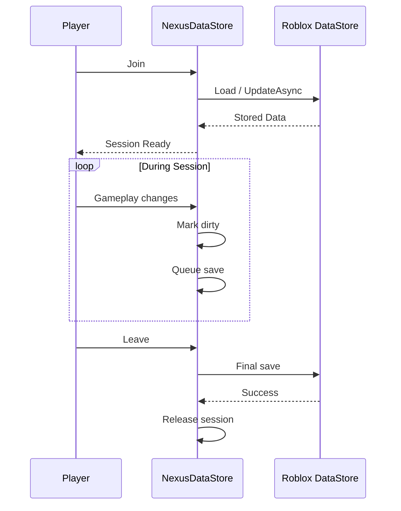

NexusDataStore
==============

NexusDataStore is a session-based DataStore module for Roblox.

It is built around one simple rule:

    Open a player's data once.
    Keep it in a session.
    Make changes to that session.
    Let the store handle saving.

This keeps the rest of the game from having to deal with UpdateAsync,
retry loops, save queues, session ownership, shutdown saves, and similar
DataStore work.

The module is intended to be used from the server.

-------------------------------------------------------------------------------
Features
-------------------------------------------------------------------------------

- Player sessions
- Session locking
- Automatic saving
- Manual saving
- Save queues
- Priority saves
- Budget-aware saving
- Retry handling
- Backoff and jitter
- Session heartbeats
- Session expiration handling
- Data templates
- Schema validation
- Data migrations
- Transactions
- Snapshots
- Backups
- Data diffing
- Data patching
- Mutation journals
- Revision tracking
- Buffer-based persistence
- Data checks
- Store events
- Session events
- Shutdown handling
- Diagnostics
- Store health information
- Multiple active sessions
- Centralized data access

-------------------------------------------------------------------------------
Installation
-------------------------------------------------------------------------------

Put the module somewhere on the server.

A simple layout is:

ServerScriptService
|
+-- Data
|   |
|   +-- NexusDataStore.lua
|
+-- PlayerData.server.lua
|
+-- Systems
    |
    +-- Inventory.lua
    +-- Rewards.lua
    +-- Quests.lua

Require the module from a server script:

local DataStore = require(script.Parent.Data.NexusDataStore)

Do not require the module from a LocalScript.

-------------------------------------------------------------------------------
Creating a Store
-------------------------------------------------------------------------------

A basic store looks like this:
```lua

local DataStore = require(script.Parent.Data.NexusDataStore)

local Store = DataStore.new({
    Name = "PlayersData",

    Template = {
        Coins = 0,
        Gems = 0,
        Level = 1,
        XP = 0,

        Inventory = {},

        Settings = {
            Music = true,
            SFX = true,
        },
    },

    AutoSave = true,
    AutoSaveInterval = 30,

    LockTimeout = 120,

    RetryAttempts = 6,

    BudgetAware = true,
})
```
The Name is the DataStore name used by the module.

Template is the default data for a new player.

The other options control the save system.

-------------------------------------------------------------------------------
Configuration
-------------------------------------------------------------------------------

Name

The name of the store.

Example:

Name = "PlayersData"

Keep this stable once the game is in production.

Changing it creates a different DataStore.

Template

The default data used when a player has no existing data.

Example:

Template = {
    Coins = 0,
    Gems = 0,
    Level = 1,
}

AutoSave

Turns automatic saving on or off.

AutoSave = true

AutoSaveInterval

How often the autosave system checks for dirty sessions.

AutoSaveInterval = 30

LockTimeout

How long a stale session can remain valid before it can be considered
expired.

LockTimeout = 120

RetryAttempts

Number of attempts used for operations that can be retried.

RetryAttempts = 6

BudgetAware

When enabled, the save system takes DataStore request budget into account.

BudgetAware = true

-------------------------------------------------------------------------------
PlayerAdded
-------------------------------------------------------------------------------

Open the session when the player joins.
```lua
local Players = game:GetService("Players")

Players.PlayerAdded:Connect(function(player)

    local session, err = Store:OpenPlayerAsync(player)

    if not session then
        warn("[DataStore] Failed to load:", player.Name, err)

        player:Kick("Your data could not be loaded. Please rejoin.")

        return
    end

    print("Loaded:", player.Name)
    print("Coins:", session.Data.Coins)

end)
```
If the session cannot be opened, it is normally better to kick the player
than to start the game with empty data.

Otherwise an empty save later could overwrite valid player data.

-------------------------------------------------------------------------------
PlayerRemoving
-------------------------------------------------------------------------------

Release the session when the player leaves.
```lua
Players.PlayerRemoving:Connect(function(player)

    local session = Store:GetSession(player)

    if not session then
        return
    end

    local success, err = Store:ReleaseAsync(session)

    if not success then
        warn(
            "[DataStore] Failed to save:",
            player.Name,
            err
        )
    end

end)
```
ReleaseAsync handles the final persistence step before the session is
removed.

Do not keep modifying a session after it has been released.

-------------------------------------------------------------------------------
Server Shutdown
-------------------------------------------------------------------------------

Always close the store when the server shuts down.
```lua
game:BindToClose(function()
    Store:Close()
end)
```
The store uses its shutdown path to deal with active sessions and pending
saves.

-------------------------------------------------------------------------------
The Session
-------------------------------------------------------------------------------

A session is the live representation of one player's data.

For example:
```lua
local session = Store:GetSession(player)

if session then
    print(session.Data.Coins)
end
```
The session contains the data currently being used by the game.

A typical flow is:

Player joins
    |
    v
OpenPlayerAsync
    |
    v
Session
    |
    v
session.Data
    |
    v
Game systems
    |
    v
Save
    |
    v
Release

The session should be treated as the source of truth while the player is
in the server.

-------------------------------------------------------------------------------
Reading Data
-------------------------------------------------------------------------------

Direct reads are simple:
```lua
local coins = session.Data.Coins

local level = session.Data.Level

local music = session.Data.Settings.Music
```
You can also use the module's data access methods when you want changes
to go through the mutation system.

-------------------------------------------------------------------------------
Changing Data
-------------------------------------------------------------------------------

For a simple change:

session.Data.Coins += 100

For a tracked change:

Store:Set(session, "Coins", 100)

Incrementing a value:

Store:Increment(session, "Coins", 100)

Subtracting:

Store:Increment(session, "Coins", -100)

For larger changes, transactions are usually a better option.

-------------------------------------------------------------------------------
Using Sessions From Other Systems
-------------------------------------------------------------------------------

A common mistake is creating a new DataStore session in every system.

Don't do this.

If Inventory.lua needs the player's data, use the existing session.

For example, a central player data module can keep track of sessions:
```lua
local Sessions = {}

Players.PlayerAdded:Connect(function(player)

    local session, err = Store:OpenPlayerAsync(player)

    if not session then
        player:Kick("Data failed to load.")
        return
    end

    Sessions[player] = session

end)

Players.PlayerRemoving:Connect(function(player)

    local session = Sessions[player]

    if session then
        Store:ReleaseAsync(session)
        Sessions[player] = nil
    end

end)
```
Then another server system can use:

local session = Sessions[player]

if session then
    Store:Increment(session, "Coins", 250)
end

The important part is that there is still only one active session for
that player.

-------------------------------------------------------------------------------
A Better Way To Share Sessions
-------------------------------------------------------------------------------

If you don't want other systems accessing the Sessions table directly,
you can expose a function:

local function GetSession(player)
    return Store:GetSession(player)
end

Then:

local session = GetSession(player)

if session then
    Store:Increment(session, "Coins", 250)
end

The store itself also provides session lookup methods.

-------------------------------------------------------------------------------
Leaderstats
-------------------------------------------------------------------------------

leaderstats should normally mirror your session.

Example:
```lua
Players.PlayerAdded:Connect(function(player)

    local session, err = Store:OpenPlayerAsync(player)

    if not session then
        player:Kick("Your data could not be loaded.")
        return
    end

    local leaderstats = Instance.new("Folder")
    leaderstats.Name = "leaderstats"
    leaderstats.Parent = player

    local coins = Instance.new("NumberValue")
    coins.Name = "Coins"
    coins.Value = session.Data.Coins
    coins.Parent = leaderstats

    coins:GetPropertyChangedSignal("Value"):Connect(function()

        if not session:IsActive() then
            return
        end

        Store:Set(
            session,
            "Coins",
            coins.Value
        )

    end)

end)
```
For a larger game, it can be cleaner to change the session first and
update leaderstats from the data change event instead.

-------------------------------------------------------------------------------
DataChanged
-------------------------------------------------------------------------------

The store can notify systems when data changes.

Example:
```lua
Store:On("DataChanged", function(
    session,
    path,
    oldValue,
    newValue
)

    print(
        session.Player.Name,
        path,
        oldValue,
        newValue
    )

end)
```
This is useful when several systems need to react to the same change.

For example:

Coins changed
    |
    +-- Leaderstats
    +-- UI replication
    +-- Analytics
    +-- Achievement checks

The exact event arguments depend on the module API.

-------------------------------------------------------------------------------
Transactions
-------------------------------------------------------------------------------

Transactions are useful when several changes belong together.

Example:
```lua
session:Transaction(function(tx)

    tx:Require("Coins", function(coins)
        return coins >= 500
    end)

    tx:Increment("Coins", -500)

    tx:Insert("Inventory", {
        Id = "Sword",
        Quantity = 1,
    })

end)
```
The idea is that the purchase is treated as one operation.

This is much safer than doing:

Store:Increment(session, "Coins", -500)

and then hoping the inventory insert succeeds.

-------------------------------------------------------------------------------
Shop Example
-------------------------------------------------------------------------------

A shop purchase could look like:
```lua
local success, err = session:Transaction(function(tx)

    tx:Require("Coins", function(coins)
        return coins >= 100
    end)

    tx:Increment("Coins", -100)

    tx:Insert("Inventory", {
        Id = "Potion",
        Quantity = 1,
    })

end)

if not success then
    warn("Purchase failed:", err)
end
```
For important game operations, validate everything on the server.

-------------------------------------------------------------------------------
Snapshots
-------------------------------------------------------------------------------

Snapshots are useful when you want to keep an in-memory copy of a state
before doing something risky.

For example:

local snapshot = session:CreateSnapshot("BeforeTrade")

Then perform the trade.

If something goes wrong:

session:RestoreSnapshot("BeforeTrade")

Snapshots are most useful for systems such as:

- Trading
- Crafting
- Inventory changes
- Prestige
- Large purchases
- Character resets

Snapshots are runtime tools. They are not a replacement for permanent
backup storage.

-------------------------------------------------------------------------------
Backups
-------------------------------------------------------------------------------

The module supports backup-oriented workflows.

A backup can be created before a destructive operation:

local backup = session:CreateBackup()

Then perform the operation.

If needed, restore it using the corresponding session API.

Do not treat runtime backups as a complete disaster recovery system.

For a production game, important data should also have an external
administration and recovery plan.

-------------------------------------------------------------------------------
Migrations
-------------------------------------------------------------------------------

Data changes over time.

For example, an old version might have:
```
{
    Coins = 100
}
```
Later you add Gems:
```
{
    Coins = 100,
    Gems = 0
}
```
Later you add Stats:
```
{
    Coins = 100,
    Gems = 0,

    Stats = {
        Level = 1,
        XP = 0,
    }
}
```
Migrations handle these changes.

Example:
```
Migrations = {

    [2] = function(data)

        data.Gems = data.Gems or 0

        return data

    end,

    [3] = function(data)

        data.Stats = data.Stats or {
            Level = 1,
            XP = 0,
        }

        return data

    end,

}
```
A migration should normally be safe to run against old data.

Once a migration has been used in production, keep it around unless you
are completely certain that no data using the old version remains.

-------------------------------------------------------------------------------
Schema
-------------------------------------------------------------------------------

A schema can be used to describe expected data.

Example:
```lua
Schema = {

    Coins = {
        Type = "number",
        Integer = true,
        Min = 0,
    },

    Gems = {
        Type = "number",
        Integer = true,
        Min = 0,
    },

    Level = {
        Type = "number",
        Integer = true,
        Min = 1,
    },

}
```
Validation can catch things such as:

- Wrong data types
- Negative currency
- Invalid values
- Missing fields
- Unexpected structures
- Oversized data

This is especially useful when the game has many systems modifying
the same player profile.

-------------------------------------------------------------------------------
Template vs Schema
-------------------------------------------------------------------------------

The two serve different purposes.

Template:

    "What should a new player's data look like?"

Schema:

    "What is valid player data?"

For example:
```lua
Template = {
    Coins = 0,
    Level = 1,
}

Schema = {
    Coins = {
        Type = "number",
        Integer = true,
        Min = 0,
    },

    Level = {
        Type = "number",
        Integer = true,
        Min = 1,
    },
}
```
-------------------------------------------------------------------------------
Autosave
-------------------------------------------------------------------------------

Enable autosaving:

AutoSave = true,
AutoSaveInterval = 30,

The important part is that autosaving should work with dirty sessions.

A typical flow is:

Data changes
    |
    v
Session becomes dirty
    |
    v
Autosave checks session
    |
    v
Save gets queued
    |
    v
Budget check
    |
    v
UpdateAsync

There is usually no reason to save a player whose data has not changed.

-------------------------------------------------------------------------------
Manual Saves
-------------------------------------------------------------------------------

You can save a session manually when needed.

Example:

local success, err = session:Save()

if not success then
    warn("Save failed:", err)
end

Manual saves are useful after particularly important operations.

For example:

- Rare rewards
- Purchases
- Trading
- Prestige
- Large inventory changes

They should not replace normal autosaving.

-------------------------------------------------------------------------------
Save All
-------------------------------------------------------------------------------

For server-wide operations:

Store:SaveAllAsync()

This can be useful before shutdown or other controlled server lifecycle
events.

-------------------------------------------------------------------------------
Save Queue
-------------------------------------------------------------------------------

The store uses a queue instead of making every system immediately call
the Roblox DataStore API.

The general flow is:

+----------------+
| Dirty Session  |
+-------+--------+
        |
        v
+----------------+
| Save Queue     |
+-------+--------+
        |
        v
+----------------+
| Budget Check   |
+-------+--------+
        |
        v
+----------------+
| Retry Pipeline |
+-------+--------+
        |
        v
+----------------+
| UpdateAsync    |
+----------------+

This keeps DataStore traffic under the control of one system.

-------------------------------------------------------------------------------
Budget Awareness
-------------------------------------------------------------------------------

Roblox DataStore requests have budgets.

If every player is saved at exactly the same time, a server can create
unnecessary pressure on those budgets.

BudgetAware = true

allows the save pipeline to consider the available request budget before
performing work.

This becomes more important as the number of players grows.

-------------------------------------------------------------------------------
Retries
-------------------------------------------------------------------------------

Temporary failures happen.

The module can retry operations rather than immediately treating the
first failure as permanent.

Configuration:

RetryAttempts = 6

A retry sequence should roughly look like:

Attempt
   |
   X
   |
Backoff
   |
Attempt
   |
   X
   |
Backoff + jitter
   |
Attempt
   |
   OK

Jitter helps avoid many servers retrying at exactly the same time.

-------------------------------------------------------------------------------
Session Locking
-------------------------------------------------------------------------------

A session represents ownership of a player's data while that player is
being handled by a server.

This matters when a player leaves one server and joins another quickly.

The module tracks session information so an old server does not simply
continue treating the player as active forever.

The lock timeout controls when stale ownership can be considered expired.

LockTimeout = 120

Do not make this extremely short. A server that is still legitimately
running should have enough time to maintain its session.

-------------------------------------------------------------------------------
Session Status
-------------------------------------------------------------------------------

You can inspect a session:

print(session:GetStatus())

You can also check:

if session:IsActive() then
    print("Session is active")
end

Other useful information includes:

print(session:GetKey())
print(session:GetPlayerUserId())
print(session:GetAge())
print(session:GetTimeSinceSave())
print(session:GetMutationCount())

-------------------------------------------------------------------------------
Finding Sessions
-------------------------------------------------------------------------------

Get the current player session:

local session = Store:GetSession(player)

Get a session by its session ID:

local session = Store:GetSessionById(sessionId)

Get all active sessions:

local sessions = Store:GetActiveSessions()

Count them:

local count = Store:CountSessions()

Check whether a player has one:

if Store:HasSession(player) then
    print("Session exists")
end

-------------------------------------------------------------------------------
Waiting For a Session
-------------------------------------------------------------------------------

Some systems may start before the player data system has finished loading.

You can wait for the session:

local session, err = Store:WaitForSession(player, 30)

if not session then
    warn("Session was not ready:", err)
    return
end

This can be useful for systems that initialize independently.

-------------------------------------------------------------------------------
Data Diff
-------------------------------------------------------------------------------

The module can compare the current data with the last persisted state.

Example:

local changes = session:DiffFromPersisted()

This is useful when debugging things like:

    "Why did this player's Coins change?"

or:

    "What did this server change before the last save?"

-------------------------------------------------------------------------------
Mutation Journal
-------------------------------------------------------------------------------

The session can keep a record of mutations.

Example:

local journal = session:GetJournal()

for _, mutation in ipairs(journal) do
    print(mutation)
end

This is primarily useful for debugging and administration.

Do not assume that a large permanent journal should be stored with every
player. Keeping huge histories inside player data defeats the purpose of
having compact player data.

-------------------------------------------------------------------------------
Revisions
-------------------------------------------------------------------------------

The session tracks revisions as its data changes.

A simplified example:

Revision 1
    Coins = 100

Revision 2
    Coins = 250

Revision 3
    Coins = 150

Revision tracking can help with:

- Debugging
- Conflict detection
- Auditing
- Rollbacks
- Data inspection

-------------------------------------------------------------------------------
Buffer Persistence
-------------------------------------------------------------------------------

The persistence layer uses a buffer-oriented storage path.

The basic idea is:

Lua data
   |
   v
Validation
   |
   v
Serialization
   |
   v
Buffer
   |
   v
Persistence envelope
   |
   v
DataStore

The point of this layer is to keep the in-game data representation
separate from the representation used for storage.

This also leaves room for the storage format to evolve without requiring
every game system to know how data is encoded.

Do not access the encoded storage representation from gameplay code.

Use:

session.Data

instead.

-------------------------------------------------------------------------------
Data Size
-------------------------------------------------------------------------------

Keep player data reasonably small.

Avoid storing things like:

- Huge chat histories
- Thousands of unnecessary entries
- Temporary state
- Roblox Instances
- Functions
- Connections
- Large debug logs
- Data that can be regenerated

A player's DataStore profile should contain the information needed to
restore their progress, not the entire state of the game server.

-------------------------------------------------------------------------------
Events
-------------------------------------------------------------------------------

Events are useful when several systems need to react to the same data
operation.

Example:
```lua
Store:On("DataChanged", function(
    session,
    path,
    oldValue,
    newValue
)

    print(
        session.Player.Name,
        path,
        oldValue,
        newValue
    )

end)
```
Save failure:
```lua
Store:On("SaveFailed", function(session, err)

    warn(
        "Save failed:",
        session.Player.Name,
        err
    )

end)
```
Session loss:
```lua
Store:On("SessionLost", function(session, err)

    warn(
        "Session lost:",
        session.Player.Name,
        err
    )

end)
```
Events are a good way to keep systems separate.

For example:

Currency system
       |
       v
Session
       |
       v
DataChanged
   /    |    \
  v     v     v
UI   Leaderstats  Analytics

-------------------------------------------------------------------------------
Store Diagnostics
-------------------------------------------------------------------------------

For debugging:

print(Store:GetHealth())

print(Store:GetMetrics())

print(Store:DumpDiagnostics())

These are useful when testing the module in Studio or trying to find out
why saves are taking longer than expected.

-------------------------------------------------------------------------------
Session Diagnostics
-------------------------------------------------------------------------------

You can inspect a session:

print(session:GetStatus())
print(session:GetStats())

Check whether the session is healthy:

if session:IsHealthy() then
    print("Session looks healthy")
end

-------------------------------------------------------------------------------
DataTemplate API
-------------------------------------------------------------------------------

The store exposes its configured template:

local template = Store:GetTemplate()

The returned value should be treated as a copy rather than something to
mutate directly.

You can also inspect the schema:

local schema = Store:GetSchema()

-------------------------------------------------------------------------------
Schema Version
-------------------------------------------------------------------------------

A store can keep track of the current schema version.

Example:

Store:SetSchemaVersion(3)

The version should correspond to the migration path used by the game.

A typical production setup is:

Version 1
    |
    v
Version 2
    |
    v
Version 3
    |
    v
Current

Avoid skipping migration logic unless the old data is guaranteed not to
exist.

-------------------------------------------------------------------------------
Player Data Script
-------------------------------------------------------------------------------

A clean project will usually have one script responsible for opening and
releasing sessions.

Example:
```lua
local Players = game:GetService("Players")

local DataStore = require(script.Parent.NexusDataStore)

local Store = DataStore.new({
    Name = "PlayersData",

    Template = {
        Coins = 0,
        Gems = 0,
        Level = 1,
        XP = 0,
        Inventory = {},
    },

    AutoSave = true,
    AutoSaveInterval = 30,
    LockTimeout = 120,
    RetryAttempts = 6,
    BudgetAware = true,
})

Players.PlayerAdded:Connect(function(player)

    local session, err = Store:OpenPlayerAsync(player)

    if not session then
        warn(
            "[DataStore] Failed to load:",
            player.Name,
            err
        )

        player:Kick(
            "Your data could not be loaded. Please rejoin."
        )

        return
    end

    print(
        "[DataStore] Loaded",
        player.Name,
        session.Data.Coins
    )

end)

Players.PlayerRemoving:Connect(function(player)

    local session = Store:GetSession(player)

    if not session then
        return
    end

    local success, err = Store:ReleaseAsync(session)

    if not success then
        warn(
            "[DataStore] Failed to save:",
            player.Name,
            err
        )
    end

end)

game:BindToClose(function()

    Store:Close()

end)
```
-------------------------------------------------------------------------------
Inventory Example
-------------------------------------------------------------------------------

An inventory system should work with the player's existing session.

Example:
```lua
local function GiveItem(player, itemId, amount)

    local session = Store:GetSession(player)

    if not session then
        return false, "NO_SESSION"
    end

    amount = amount or 1

    return session:Transaction(function(tx)

        tx:Insert("Inventory", {
            Id = itemId,
            Quantity = amount,
        })

    end)

end
```
The important part is that GiveItem does not open another session.

-------------------------------------------------------------------------------
Currency Example
-------------------------------------------------------------------------------
```lua
local function GiveCoins(player, amount)

    local session = Store:GetSession(player)

    if not session then
        return false, "NO_SESSION"
    end

    if amount <= 0 then
        return false, "INVALID_AMOUNT"
    end

    return Store:Increment(
        session,
        "Coins",
        amount
    )

end
```
-------------------------------------------------------------------------------
Trading Example
-------------------------------------------------------------------------------

Trading is one of the areas where session-based data is particularly
useful.

A trade should generally involve the sessions of both players.

Conceptually:

Player A Session
       |
       | remove item
       v
Trade Transaction
       ^
       | add item
       |
Player B Session

Before committing a trade, check:

- Both sessions are active
- Both players still own the items
- Quantities are valid
- The trade has not expired
- The players are still allowed to trade

Do not trust the client to tell the server which items it owns.

-------------------------------------------------------------------------------
Purchases
-------------------------------------------------------------------------------

For purchases that change persistent data:

1. Validate the request on the server.
2. Validate the player's current data.
3. Perform the mutation.
4. Mark the session dirty.
5. Let the normal save system handle persistence.
6. Use a priority/manual save when the operation warrants it.

Do not use the client as the source of truth for currency or inventory.

-------------------------------------------------------------------------------
What Should Go In Player Data?
-------------------------------------------------------------------------------

Good candidates:

- Currency
- Level
- XP
- Inventory
- Unlocks
- Settings
- Quest progress
- Permanent statistics
- Purchased content
- Achievement state

Bad candidates:

- Instances
- Parts
- Connections
- Temporary effects
- Current combat targets
- Render state
- Server-only objects
- Large logs
- Cached objects that can be rebuilt

If something can be recreated when the player joins, it probably does not
need to live in the persistent profile.

-------------------------------------------------------------------------------
What Not To Do
-------------------------------------------------------------------------------

Do not do this:
```lua
local DataStoreService = game:GetService("DataStoreService")

local Store = DataStoreService:GetDataStore("Players")

Players.PlayerAdded:Connect(function(player)

    local data = Store:GetAsync(player.UserId)

    -- game code

    Store:SetAsync(player.UserId, data)

end)
```
That approach leaves every system responsible for its own loading,
saving, error handling, and shutdown behavior.

Do not do this either:
```lua
Players.PlayerAdded:Connect(function(player)

    local session = Store:OpenPlayerAsync(player)

    -- later another system:
    local otherSession = Store:OpenPlayerAsync(player)

end)
```
There should be one active session.

-------------------------------------------------------------------------------
Recommended Game Structure
-------------------------------------------------------------------------------

For a larger game, something like this works well:

ServerScriptService
|
+-- Data
|   |
|   +-- NexusDataStore.lua
|   +-- PlayerData.server.lua
|
+-- Systems
|   |
|   +-- Currency.lua
|   +-- Inventory.lua
|   +-- Quests.lua
|   +-- Trading.lua
|   +-- Rewards.lua
|   +-- Settings.lua
|
+-- Services
    |
    +-- MatchService.lua
    +-- ShopService.lua
    +-- QuestService.lua

PlayerData.server.lua owns the session lifecycle.

Other systems use the active session.

-------------------------------------------------------------------------------
Lifecycle
-------------------------------------------------------------------------------

The full player lifecycle is roughly:



The session exists between loading and releasing.

-------------------------------------------------------------------------------
Error Handling
-------------------------------------------------------------------------------

Always check the result of important operations.

Example:
```lua
local success, err = Store:Increment(
    session,
    "Coins",
    100
)

if not success then
    warn("Could not change coins:", err)
end
```
Likewise for loading:
```lua
local session, err = Store:OpenPlayerAsync(player)

if not session then
    warn("Load failed:", err)
    player:Kick("Data failed to load.")
    return
end
```
Do not silently ignore DataStore errors.

-------------------------------------------------------------------------------
Testing
-------------------------------------------------------------------------------

When testing in Studio, test more than just:

    Player joins
    Player leaves

Also test:

- Joining with no existing data
- Joining with existing data
- Leaving normally
- Server shutdown
- Rejoining quickly
- Multiple players
- Repeated mutations
- Save failures
- Retry behavior
- Invalid data
- Migration from older versions
- Large inventories
- Transaction failures
- Session loss
- Multiple servers

A DataStore system can appear to work perfectly during normal testing
and still fail under unusual server conditions.

-------------------------------------------------------------------------------
Production Checklist
-------------------------------------------------------------------------------

Before releasing:

[ ] DataStore name is correct

[ ] Template contains all required defaults

[ ] PlayerAdded handles failed loads

[ ] PlayerRemoving releases sessions

[ ] BindToClose is configured

[ ] Autosave is enabled

[ ] Retry handling is enabled

[ ] Budget awareness is enabled

[ ] Currency is server-authoritative

[ ] Inventory changes are server-authoritative

[ ] Migrations have been tested

[ ] Schema validation has been tested

[ ] Transactions have failure tests

[ ] Large data has been tested

[ ] Session locking has been tested

[ ] Shutdown saving has been tested

[ ] No system opens duplicate sessions

-------------------------------------------------------------------------------
API
-------------------------------------------------------------------------------

Store

    DataStore.new(config)

    OpenPlayerAsync(player)

    GetSession(player)

    GetSessionById(sessionId)

    GetActiveSessions()

    WaitForSession(player, timeout)

    HasSession(player)

    CountSessions()

    Set(session, path, value)

    Increment(session, path, amount)

    QueueSave(session, priority, reason)

    SaveAsync(session)

    SaveAllAsync(timeout)

    FlushAsync(timeout)

    ReleaseAsync(session)

    Close()

    On(eventName, callback)

    GetHealth()

    GetMetrics()

    DumpDiagnostics()

    GetSchema()

    GetTemplate()

    SetSchemaVersion(version)

    GetMigrationHistory()

Session

    IsActive()

    GetPlayerUserId()

    GetKey()

    GetAge()

    GetTimeSinceSave()

    GetMutationCount()

    GetJournal()

    ClearDirty()

    MarkDirty()

    Save()

    Flush()

    Health()

    DiffFromPersisted()

    IsHealthy()

    Replace(data)

    Update(callback)

    Transaction(callback)

Transaction

    Get(path)

    Set(path, value)

    SetIf(path, predicate, value)

    Delete(path)

    DeleteIf(path, predicate)

    Increment(path, amount)

    Insert(path, value)

    Remove(path, value)

    Require(path, predicate)

    Count(path)

    Contains(path, value)

    Touch()

-------------------------------------------------------------------------------
Version
-------------------------------------------------------------------------------

NexusDataStore V6.1

The V6.1 rewrite focuses on keeping the public API large without
duplicating the same functions in multiple places.

The module is intentionally kept as a single ModuleScript.

-------------------------------------------------------------------------------
Notes
-------------------------------------------------------------------------------

NexusDataStore does not remove Roblox DataStore limits.

It does not make DataStoreService unlimited.

It does not guarantee that Roblox services can never fail.

What it does is keep those problems in one place so the rest of the game
can work with a normal in-memory player session.

The recommended pattern is:

    Open
      |
      v
    Session
      |
      +-- Read
      +-- Update
      +-- Transaction
      +-- Events
      +-- Autosave
      |
      v
    Release

Keep the player session alive for the entire time the player is in the
server and let the store handle the persistence side.

-------------------------------------------------------------------------------
License
-------------------------------------------------------------------------------

Free to use

-------------------------------------------------------------------------------
End
-------------------------------------------------------------------------------
